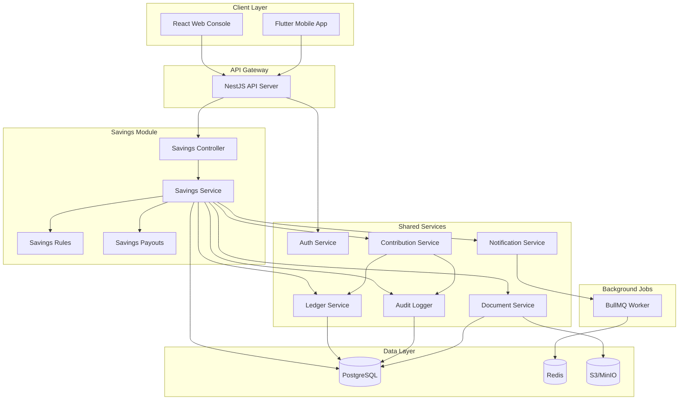
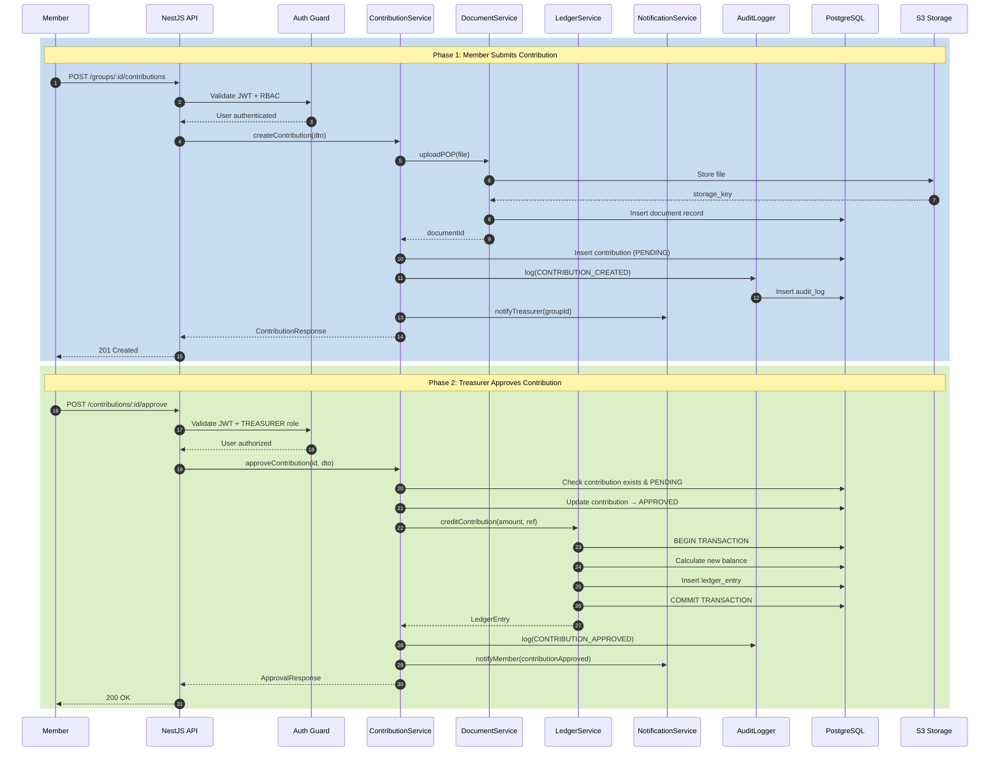
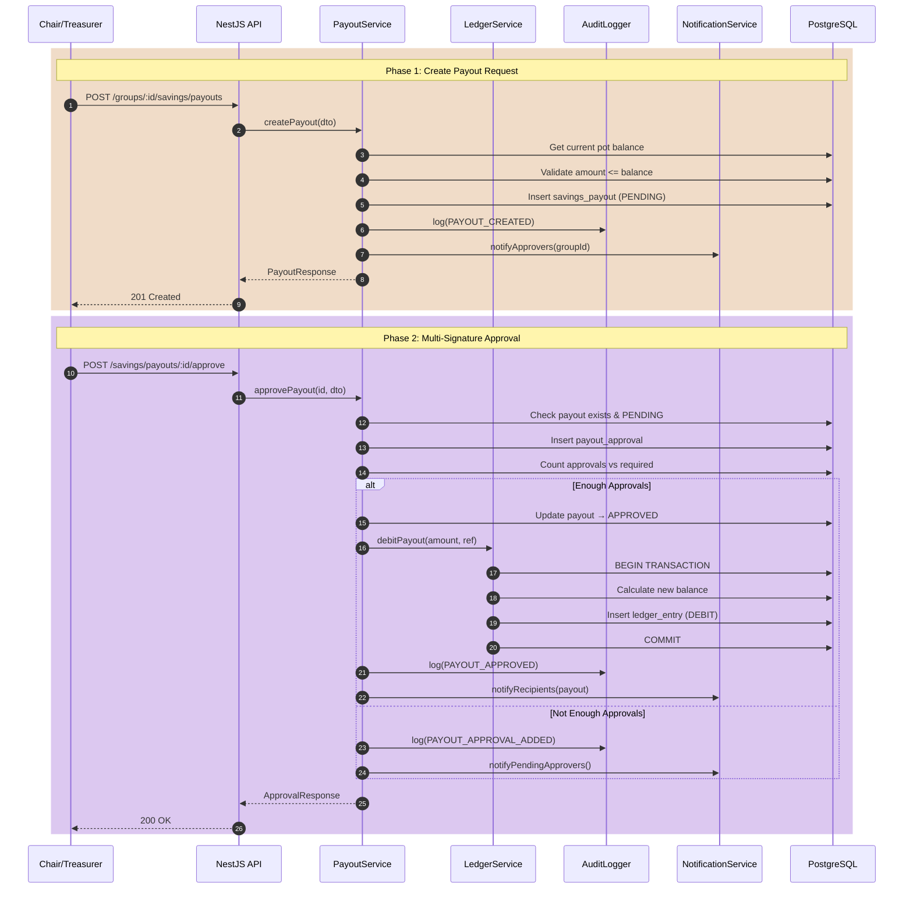

# Savings Stokvel Module - Architecture Document

## 1. Overview

The Savings Stokvel module enables members to contribute fixed recurring amounts to a shared pot, with governance controls for approvals, payouts, and audit trails. This document describes the architecture, data flows, and integration points.

## 2. Module Location in System

```
┌─────────────────────────────────────────────────────────────────────────┐
│                          STOCKVEL OS PLATFORM                          │
├─────────────────────────────────────────────────────────────────────────┤
│                                                                         │
│  ┌─────────────┐  ┌─────────────┐  ┌─────────────┐  ┌─────────────┐   │
│  │   SAVINGS   │  │   GROCERY   │  │   BURIAL    │  │    ROSCA    │   │
│  │   MODULE    │  │   MODULE    │  │   MODULE    │  │   MODULE    │   │
│  └──────┬──────┘  └─────────────┘  └─────────────┘  └─────────────┘   │
│         │                                                               │
├─────────┼───────────────────────────────────────────────────────────────┤
│         │           SHARED PLATFORM SERVICES                            │
│         │                                                               │
│  ┌──────▼──────┐  ┌─────────────┐  ┌─────────────┐  ┌─────────────┐   │
│  │   GROUPS    │  │    AUTH     │  │   LEDGER    │  │    AUDIT    │   │
│  │ MEMBERSHIP  │  │   & RBAC    │  │   SERVICE   │  │   SERVICE   │   │
│  └─────────────┘  └─────────────┘  └─────────────┘  └─────────────┘   │
│                                                                         │
│  ┌─────────────┐  ┌─────────────┐  ┌─────────────┐  ┌─────────────┐   │
│  │  DOCUMENTS  │  │NOTIFICATIONS│  │   STORAGE   │  │  JOBS/QUEUE │   │
│  │   SERVICE   │  │   SERVICE   │  │    (S3)     │  │  (BullMQ)   │   │
│  └─────────────┘  └─────────────┘  └─────────────┘  └─────────────┘   │
│                                                                         │
└─────────────────────────────────────────────────────────────────────────┘
```

## 3. System Component View (Savings Flows)



## 4. Sequence Diagram: Contribution Workflow



## 5. Sequence Diagram: Payout Workflow



## 6. Integration Points

### 6.1 Auth Service
- Validates JWT tokens
- Provides user context
- Manages sessions
- RBAC guard decorators

### 6.2 Groups & Membership Service
- Creates savings groups (type = 'SAVINGS')
- Manages member roles (MEMBER, TREASURER, CHAIRPERSON)
- Enforces one-chair-per-savings-group rule

### 6.3 Ledger Service
- Append-only financial record
- Transactional balance updates
- Supports CREDIT/DEBIT entry types
- Never deletes, only adjustments

### 6.4 Document Service
- S3-compatible file storage
- Signed URL generation
- Metadata tracking
- Access control per group

### 6.5 Notification Service
- Email/SMS/Push notifications
- Queued via BullMQ
- Templates for:
  - Contribution reminders
  - Approval requests
  - Payout notifications
  - Late payment alerts

### 6.6 Audit Service
- Structured logging for all mutations
- Before/after state snapshots
- Actor tracking
- Compliance reporting

## 7. Data Flow Summary

| Flow | Trigger | Services Involved | Audit Event |
|------|---------|-------------------|-------------|
| Submit Contribution | Member | Contribution, Document, Notification | CONTRIBUTION_CREATED |
| Approve Contribution | Treasurer | Contribution, Ledger, Notification | CONTRIBUTION_APPROVED |
| Reject Contribution | Treasurer | Contribution, Notification | CONTRIBUTION_REJECTED |
| Create Payout | Chair/Treasurer | Payout, Notification | PAYOUT_CREATED |
| Approve Payout | Chair + Treasurer | Payout, Ledger, Notification | PAYOUT_APPROVED |
| Update Rules | Chairperson | Savings Rules, Notification | RULES_UPDATED |
| Generate Statement | Member/System | Ledger, Document | STATEMENT_GENERATED |

## 8. Security Considerations

### 8.1 Role-Based Access Control (RBAC)

| Action | MEMBER | TREASURER | CHAIRPERSON | PLATFORM_ADMIN |
|--------|--------|-----------|-------------|----------------|
| View own contributions | ✅ | ✅ | ✅ | ❌ |
| Submit contribution | ✅ | ✅ | ✅ | ❌ |
| Approve contribution | ❌ | ✅ | ✅ | ❌ |
| Create payout | ❌ | ✅ | ✅ | ❌ |
| Approve payout | ❌ | ✅ | ✅ | ❌ |
| Modify rules | ❌ | ❌ | ✅ | ❌ |
| View group ledger | ✅ | ✅ | ✅ | ❌ |
| View all group data | ❌ | ✅ | ✅ | ❌ |

### 8.2 Data Protection
- PII encrypted at rest
- Bank details encrypted with separate key
- Signed URLs expire after 15 minutes
- Rate limiting on all endpoints
- POPIA compliance for SA data

## 9. Offline Support Strategy

### 9.1 Mobile Offline Queue
```
┌────────────────────────────────────────────────────────┐
│                    MOBILE APP                          │
├────────────────────────────────────────────────────────┤
│  ┌──────────────┐    ┌──────────────┐                 │
│  │  UI Layer    │───▶│ State Mgmt   │                 │
│  └──────────────┘    │  (Riverpod)  │                 │
│                      └──────┬───────┘                 │
│                             │                          │
│  ┌──────────────────────────▼─────────────────────┐   │
│  │              SYNC SERVICE                       │   │
│  │  ┌─────────┐  ┌─────────┐  ┌─────────────────┐ │   │
│  │  │ Online  │  │ Offline │  │ Conflict        │ │   │
│  │  │ Handler │  │ Queue   │  │ Resolution      │ │   │
│  │  └────┬────┘  └────┬────┘  └─────────────────┘ │   │
│  └───────┼────────────┼──────────────────────────────┘│
│          │            │                               │
│  ┌───────▼────────────▼───────────────────────────┐   │
│  │           LOCAL DATABASE (Drift)                │   │
│  │  ┌──────────┐  ┌──────────┐  ┌──────────────┐ │   │
│  │  │ Pending  │  │ Cached   │  │ Sync         │ │   │
│  │  │ Actions  │  │ Data     │  │ Metadata     │ │   │
│  │  └──────────┘  └──────────┘  └──────────────┘ │   │
│  └────────────────────────────────────────────────┘   │
└────────────────────────────────────────────────────────┘
```

### 9.2 Idempotency Keys
- Client generates UUID for each action
- Server stores in `idempotency_keys` table
- Duplicate requests return cached response
- Keys expire after 24 hours

## 10. Performance Considerations

- Ledger queries indexed by `stokvel_id` + `created_at`
- Contribution lookups indexed by `stokvel_id` + `period_start` + `member_id`
- Redis caching for pot balance (invalidated on ledger update)
- Pagination on all list endpoints
- Background job processing for notifications
