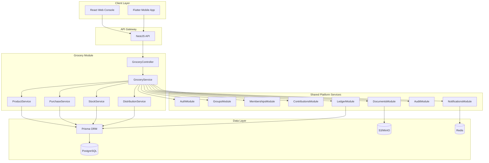
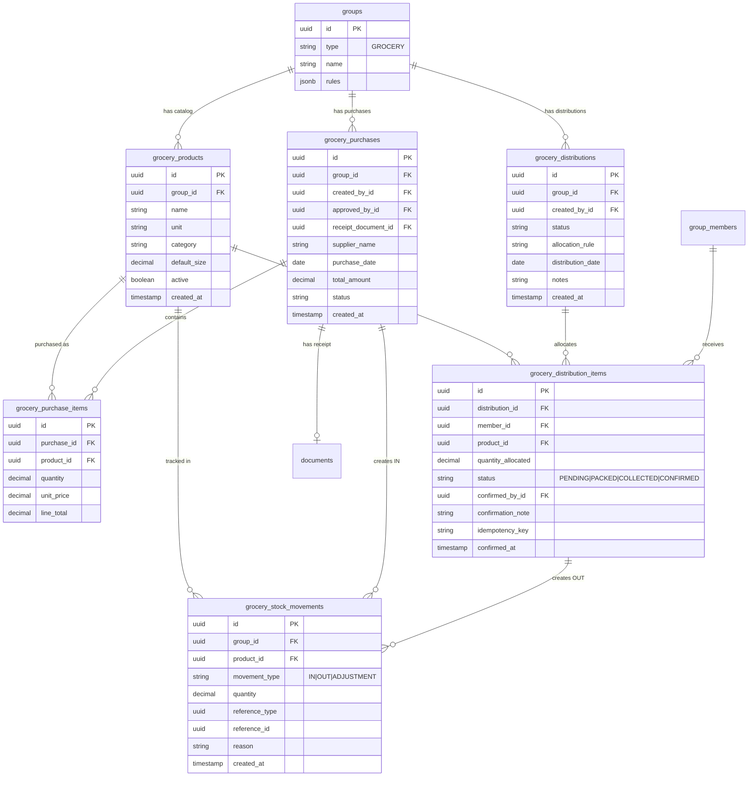
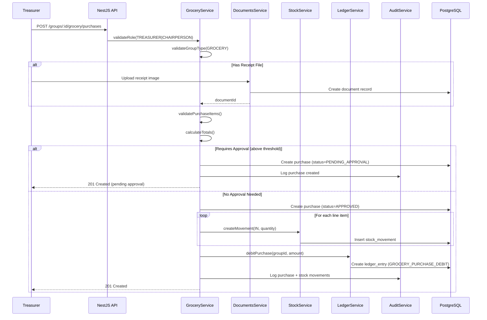
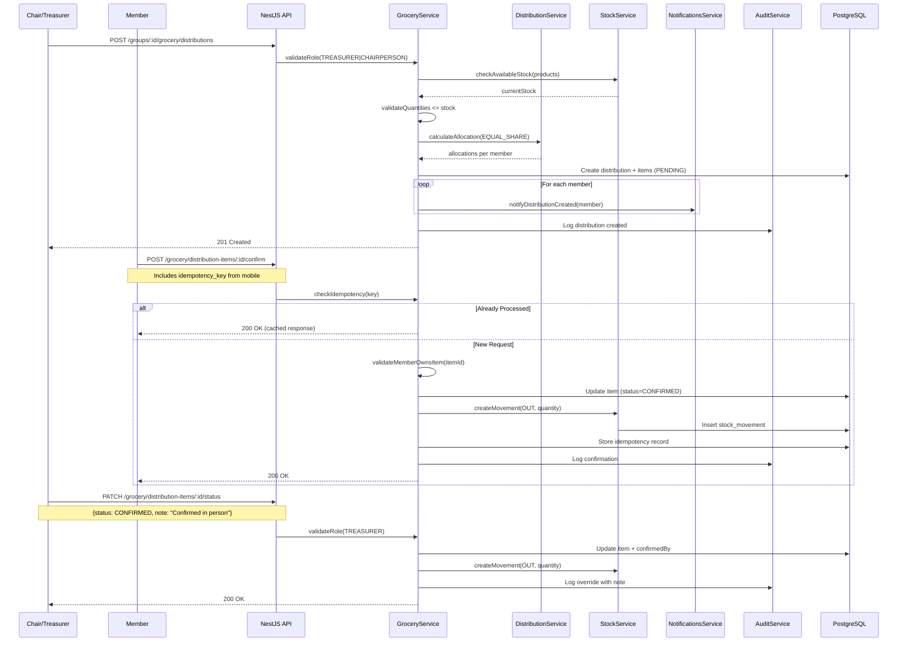

# 🛒 Grocery Stokvel Module - Architecture Documentation

## Overview

The Grocery Stokvel module enables groups to collectively save money, purchase groceries in bulk, manage inventory (stock), and fairly distribute goods to members. This module integrates with the core Stockvel OS platform while maintaining domain separation from other stokvel types (Savings, Burial, ROSCA).

## Domain Model

### Core Concepts

1. **Grocery Group** - A group with `type = GROCERY` that pools member contributions to buy groceries
2. **Product Catalog** - Group-specific catalog of products that can be purchased and tracked
3. **Bulk Purchase** - Record of buying groceries/vouchers from suppliers (stock-in)
4. **Stock Movement** - Immutable log of all stock changes (IN, OUT, ADJUSTMENT)
5. **Distribution Event** - Planned distribution of stock to members
6. **Distribution Item** - Individual allocation of a product to a specific member

### Key Behaviors

```
┌─────────────────────────────────────────────────────────────────────────┐
│                        GROCERY STOKVEL FLOW                             │
├─────────────────────────────────────────────────────────────────────────┤
│                                                                         │
│   [Members]                                                             │
│      │                                                                  │
│      ▼                                                                  │
│   ┌──────────────┐     ┌─────────────────┐     ┌─────────────────┐    │
│   │ Contribute   │────▶│ Group Pot       │────▶│ Bulk Purchase   │    │
│   │ (shared flow)│     │ (ledger_entries)│     │ (stock-in)      │    │
│   └──────────────┘     └─────────────────┘     └────────┬────────┘    │
│                                                         │              │
│                                                         ▼              │
│                                                  ┌─────────────┐       │
│                                                  │   STOCK     │       │
│                                                  │ (inventory) │       │
│                                                  └──────┬──────┘       │
│                                                         │              │
│                                                         ▼              │
│   ┌──────────────┐     ┌─────────────────┐     ┌─────────────────┐    │
│   │ Member Gets  │◀────│ Distribution    │◀────│ Allocate &      │    │
│   │ Goods        │     │ Items           │     │ Distribute      │    │
│   └──────────────┘     └─────────────────┘     │ (stock-out)     │    │
│         │                                       └─────────────────┘    │
│         ▼                                                              │
│   ┌──────────────┐                                                     │
│   │ Confirm      │                                                     │
│   │ Receipt      │                                                     │
│   └──────────────┘                                                     │
│                                                                         │
└─────────────────────────────────────────────────────────────────────────┘
```

## Integration with Platform Services

### System Architecture



### Module Dependencies

| Module | Dependency | Purpose |
|--------|------------|---------|
| Grocery → Groups | Read group info, validate `type = GROCERY` |
| Grocery → Memberships | Validate member roles, get active members for distribution |
| Grocery → Contributions | Read contributions (shared flow) for fairness reports |
| Grocery → Ledger | Record `GROCERY_PURCHASE` as debits from pot |
| Grocery → Documents | Store purchase receipts, distribution summaries |
| Grocery → Audit | Log all sensitive operations |
| Grocery → Notifications | Alert members of distributions, confirmations needed |

## Entity Relationship Diagram



## Sequence Diagrams

### Record Bulk Purchase



### Distribution & Member Confirmation



## Roles & Permissions Matrix

| Action | MEMBER | TREASURER | CHAIRPERSON | PLATFORM_ADMIN |
|--------|--------|-----------|-------------|----------------|
| View products | ✅ | ✅ | ✅ | ❌ (no group access) |
| Create/Edit products | ❌ | ✅ | ✅ | ❌ |
| View stock | ✅ | ✅ | ✅ | ❌ |
| Create purchase | ❌ | ✅ | ✅ | ❌ |
| Approve purchase | ❌ | ✅ | ✅ | ❌ |
| Create distribution | ❌ | ✅ | ✅ | ❌ |
| Override allocation | ❌ | ✅ | ✅ | ❌ |
| Confirm own receipt | ✅ | ✅ | ✅ | ❌ |
| Confirm others' receipt | ❌ | ✅ | ✅ | ❌ |
| View fairness reports | ✅ | ✅ | ✅ | ❌ |

## Governance Rules

### Purchase Approval Workflow

```typescript
// Group rules JSON structure
{
  "grocery": {
    "allocationRule": "EQUAL_SHARE",
    "purchaseApprovalThreshold": 5000.00,  // ZAR
    "requireChairApproval": true,
    "autoApproveBelow": 1000.00
  }
}
```

**Logic:**
1. Purchase amount ≤ `autoApproveBelow` → Auto-approved
2. Purchase amount > `purchaseApprovalThreshold` → Requires Chair approval
3. All purchases are logged in audit regardless of approval path

### Stock Integrity Rules

1. **Stock = Sum of Movements**: No direct stock quantity field. Current stock is calculated:
   ```sql
   SELECT product_id, 
          SUM(CASE WHEN movement_type = 'IN' THEN quantity
                   WHEN movement_type = 'OUT' THEN -quantity
                   WHEN movement_type = 'ADJUSTMENT' THEN quantity
              END) as current_stock
   FROM grocery_stock_movements
   WHERE group_id = :groupId
   GROUP BY product_id
   ```

2. **Cannot Over-Distribute**: Distribution quantities validated against available stock
3. **No Negative Stock**: Movement creation fails if result would be negative

### Allocation Rules

Currently supported: `EQUAL_SHARE`
```typescript
allocation[member] = totalQuantity / eligibleMemberCount
```

Future: `PROPORTIONAL_TO_CONTRIBUTION`, `CUSTOM`

## Offline-First Mobile Strategy

### Local Database Schema (Drift/SQLite)

```dart
// Offline queue for confirmations
class OfflineGroceryActions extends Table {
  TextColumn get id => text()();
  TextColumn get actionType => text()(); // CONFIRM_DISTRIBUTION_ITEM
  TextColumn get payload => text()(); // JSON
  TextColumn get idempotencyKey => text()();
  IntColumn get retryCount => integer().withDefault(const Constant(0))();
  DateTimeColumn get createdAt => dateTime()();
  DateTimeColumn get syncedAt => dateTime().nullable()();
  
  @override
  Set<Column> get primaryKey => {id};
}
```

### Sync Flow

```
┌─────────────────────────────────────────────────────────────┐
│                     OFFLINE SYNC FLOW                        │
├─────────────────────────────────────────────────────────────┤
│                                                              │
│  ┌──────────┐    ┌──────────┐    ┌──────────────────────┐  │
│  │ User     │    │ Local    │    │ API                  │  │
│  │ Action   │───▶│ Queue    │    │                      │  │
│  └──────────┘    └────┬─────┘    │                      │  │
│                       │          │                      │  │
│                       │ Offline  │                      │  │
│                       ▼          │                      │  │
│              ┌────────────────┐  │                      │  │
│              │ Store with     │  │                      │  │
│              │ idempotency_key│  │                      │  │
│              └───────┬────────┘  │                      │  │
│                      │           │                      │  │
│                      │ Online    │                      │  │
│                      ▼           │                      │  │
│              ┌────────────────┐  │                      │  │
│              │ Sync Service   │──┼──▶ POST /confirm    │  │
│              │ replays queue  │◀─┼─── 200 OK           │  │
│              └────────────────┘  │                      │  │
│                                  │                      │  │
└─────────────────────────────────────────────────────────────┘
```

### Idempotency Implementation

**Backend Table:**
```sql
CREATE TABLE grocery_idempotency_keys (
  key VARCHAR(100) PRIMARY KEY,
  action_type VARCHAR(50) NOT NULL,
  reference_id UUID NOT NULL,
  response JSONB NOT NULL,
  created_at TIMESTAMPTZ DEFAULT NOW(),
  expires_at TIMESTAMPTZ NOT NULL
);
```

**Logic:**
1. Mobile generates UUID `idempotency_key` for each action
2. API checks if key exists before processing
3. If exists, return cached response (no state change)
4. If new, process action and store key with response
5. Keys expire after 7 days (cleanup job)

## Alert & Notification Triggers

| Event | Recipients | Channel |
|-------|------------|---------|
| New distribution created | All members in distribution | PUSH, IN_APP |
| Item marked PACKED | Assigned member | PUSH |
| Unconfirmed after 3 days | Assigned member + Treasurer | PUSH, SMS |
| Stock mismatch detected | Treasurer, Chair | IN_APP |
| Purchase requires approval | Chairperson | PUSH, IN_APP |
| Purchase approved/rejected | Treasurer who created | IN_APP |

## API Endpoints Summary

### Product Catalog
- `POST /groups/:groupId/grocery/products` - Create product
- `GET /groups/:groupId/grocery/products` - List products
- `PATCH /groups/:groupId/grocery/products/:productId` - Update product
- `DELETE /groups/:groupId/grocery/products/:productId` - Soft delete

### Purchases
- `POST /groups/:groupId/grocery/purchases` - Record purchase
- `GET /groups/:groupId/grocery/purchases` - List purchases
- `GET /groups/:groupId/grocery/purchases/:purchaseId` - Get purchase detail
- `POST /groups/:groupId/grocery/purchases/:purchaseId/approve` - Approve purchase

### Stock
- `GET /groups/:groupId/grocery/stock` - Current stock levels
- `GET /groups/:groupId/grocery/stock/movements` - Stock movement history

### Distributions
- `POST /groups/:groupId/grocery/distributions` - Create distribution
- `GET /groups/:groupId/grocery/distributions` - List distributions
- `GET /groups/:groupId/grocery/distributions/:distributionId` - Get distribution detail

### Distribution Items
- `PATCH /grocery/distribution-items/:id/status` - Update item status
- `POST /grocery/distribution-items/:id/confirm` - Member confirmation (idempotent)

### Member Views
- `GET /me/grocery/groups` - My grocery groups
- `GET /me/grocery/groups/:groupId/allocations` - My pending allocations
- `GET /me/grocery/groups/:groupId/history` - My distribution history
- `GET /groups/:groupId/grocery/member/:memberId/summary` - Member fairness summary
